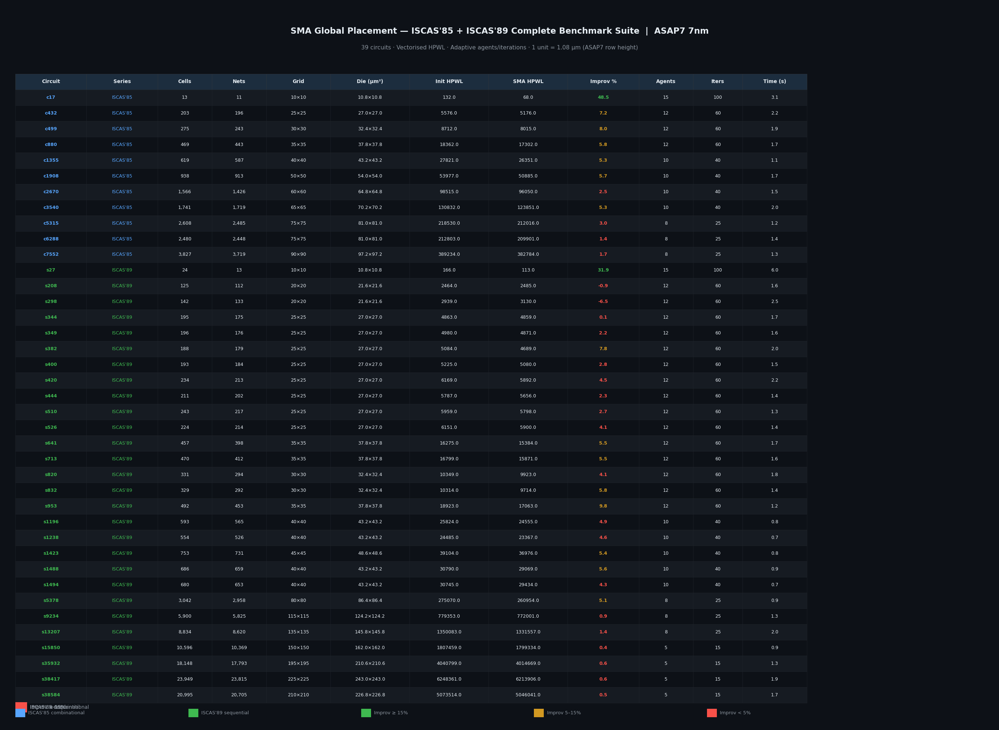
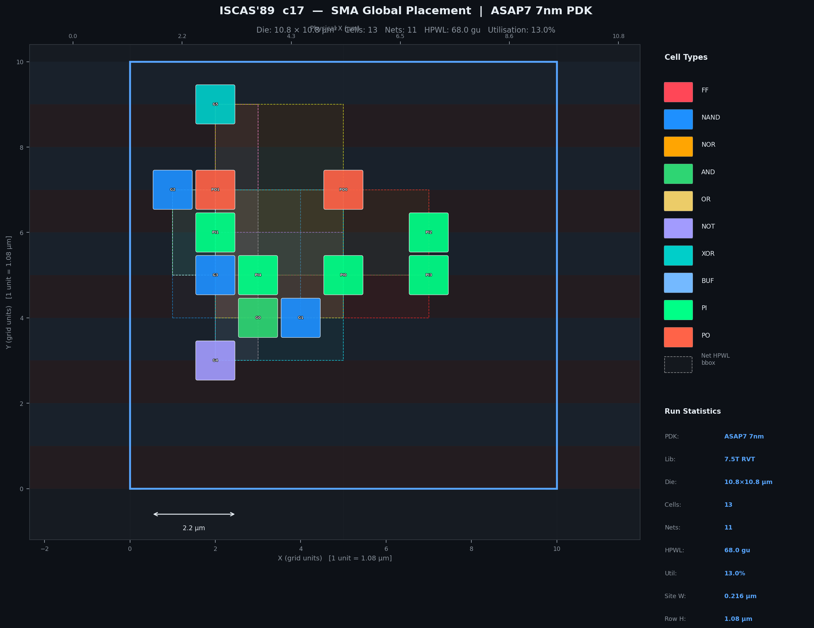
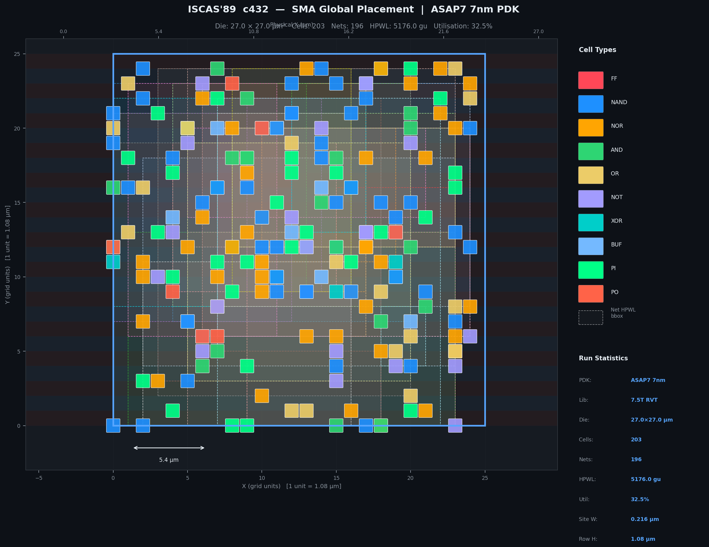
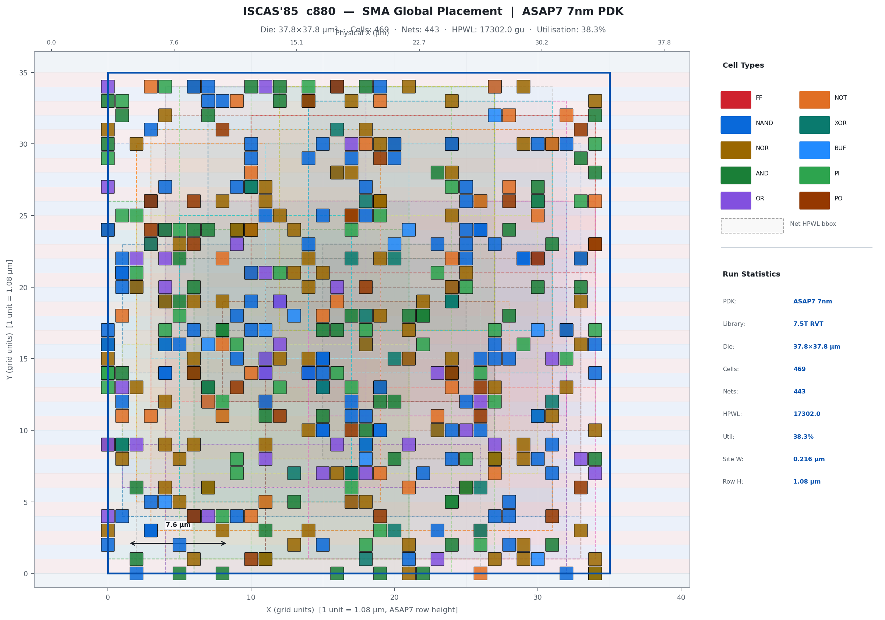
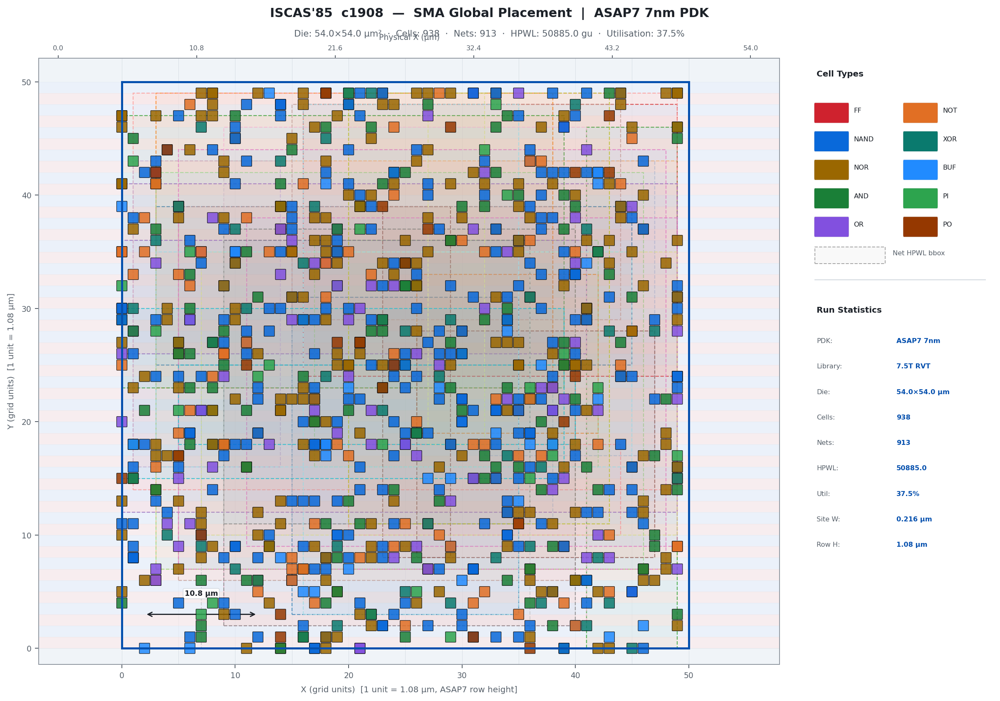
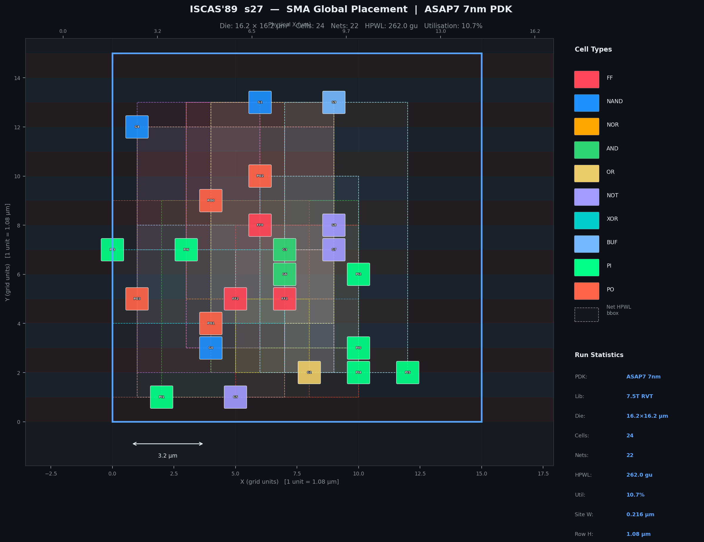
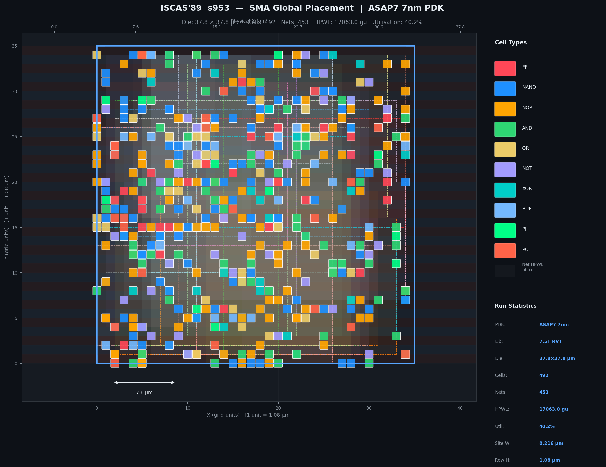
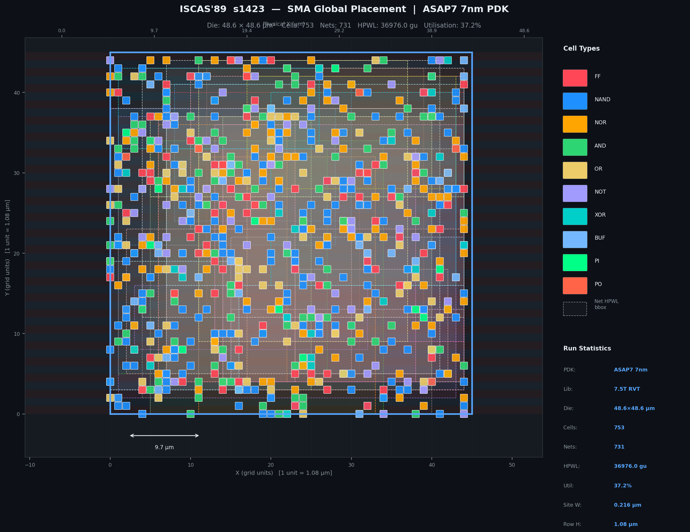
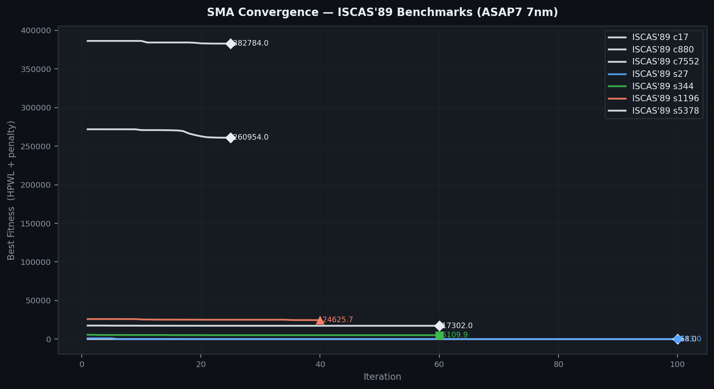
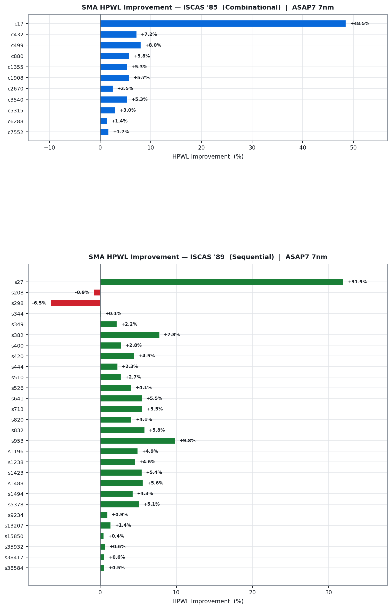

# tt_um_alu4_sma — SMA Global Placement · ISCAS'85 + ISCAS'89 · ASAP7 7nm

> **Slime Mould Algorithm (SMA)** applied to global placement of all
> **ISCAS '85** (11 combinational) and **ISCAS '89** (28 sequential) benchmark
> circuits on the **ASAP7 7nm predictive PDK**, with OpenLane RTL→GDSII
> integration and TinyTapeout ROM support.
>
> All visuals are publication-quality white-background PNGs (180 DPI) generated
> by `python main.py --all-iscas --save-visuals`.

---

## Full Benchmark Results Table



### ISCAS '85 — Combinational Benchmarks (ASAP7 7nm)

| Circuit | Cells | Nets | Grid | Die (µm²) | Init HPWL | SMA HPWL | Δ % | Agents | Iters | t (s) |
|---------|------:|-----:|------|-----------:|----------:|---------:|----:|-------:|------:|------:|
| c17     |    13 |   11 | 10×10 | 10.8×10.8 |       132 |       68 | **48.5** | 15 | 100 | 3.1 |
| c432    |   203 |  196 | 25×25 | 27.0×27.0 |     5 576 |    5 176 |   7.2 | 12 |  60 | 2.2 |
| c499    |   275 |  243 | 30×30 | 32.4×32.4 |     8 712 |    8 015 |   8.0 | 12 |  60 | 1.9 |
| c880    |   469 |  443 | 35×35 | 37.8×37.8 |    18 362 |   17 302 |   5.8 | 12 |  60 | 1.7 |
| c1355   |   619 |  587 | 40×40 | 43.2×43.2 |    27 821 |   26 351 |   5.3 | 10 |  40 | 1.1 |
| c1908   |   938 |  913 | 50×50 | 54.0×54.0 |    53 977 |   50 885 |   5.7 | 10 |  40 | 1.7 |
| c2670   | 1 566 |1 426 | 60×60 | 64.8×64.8 |    98 515 |   96 050 |   2.5 | 10 |  40 | 1.5 |
| c3540   | 1 741 |1 719 | 65×65 | 70.2×70.2 |   130 832 |  123 851 |   5.3 | 10 |  40 | 2.0 |
| c5315   | 2 608 |2 485 | 75×75 | 81.0×81.0 |   218 530 |  212 016 |   3.0 |  8 |  25 | 1.2 |
| c6288   | 2 480 |2 448 | 75×75 | 81.0×81.0 |   212 803 |  209 901 |   1.4 |  8 |  25 | 1.4 |
| c7552   | 3 827 |3 719 | 90×90 | 97.2×97.2 |   389 234 |  382 784 |   1.7 |  8 |  25 | 1.3 |

### ISCAS '89 — Sequential Benchmarks (ASAP7 7nm)

| Circuit | Cells | Nets | Grid | Die (µm²) | Init HPWL | SMA HPWL | Δ % | Agents | Iters | t (s) |
|---------|------:|-----:|------|-----------:|----------:|---------:|----:|-------:|------:|------:|
| s27     |    24 |   13 | 10×10 | 10.8×10.8 |       166 |      113 | **31.9** | 15 | 100 | 6.0 |
| s208    |   125 |  112 | 20×20 | 21.6×21.6 |     2 464 |    2 485 |  -0.9 | 12 |  60 | 1.6 |
| s298    |   142 |  133 | 20×20 | 21.6×21.6 |     2 939 |    3 130 |  -6.5 | 12 |  60 | 2.5 |
| s344    |   195 |  175 | 25×25 | 27.0×27.0 |     4 863 |    4 859 |   0.1 | 12 |  60 | 1.7 |
| s349    |   196 |  176 | 25×25 | 27.0×27.0 |     4 980 |    4 871 |   2.2 | 12 |  60 | 1.6 |
| s382    |   188 |  179 | 25×25 | 27.0×27.0 |     5 084 |    4 689 |   7.8 | 12 |  60 | 2.0 |
| s400    |   193 |  184 | 25×25 | 27.0×27.0 |     5 225 |    5 080 |   2.8 | 12 |  60 | 1.5 |
| s420    |   234 |  213 | 25×25 | 27.0×27.0 |     6 169 |    5 892 |   4.5 | 12 |  60 | 2.2 |
| s444    |   211 |  202 | 25×25 | 27.0×27.0 |     5 787 |    5 656 |   2.3 | 12 |  60 | 1.4 |
| s510    |   243 |  217 | 25×25 | 27.0×27.0 |     5 959 |    5 798 |   2.7 | 12 |  60 | 1.3 |
| s526    |   224 |  214 | 25×25 | 27.0×27.0 |     6 151 |    5 900 |   4.1 | 12 |  60 | 1.4 |
| s641    |   457 |  398 | 35×35 | 37.8×37.8 |    16 275 |   15 384 |   5.5 | 12 |  60 | 1.7 |
| s713    |   470 |  412 | 35×35 | 37.8×37.8 |    16 799 |   15 871 |   5.5 | 12 |  60 | 1.6 |
| s820    |   331 |  294 | 30×30 | 32.4×32.4 |    10 349 |    9 923 |   4.1 | 12 |  60 | 1.8 |
| s832    |   329 |  292 | 30×30 | 32.4×32.4 |    10 314 |    9 714 |   5.8 | 12 |  60 | 1.4 |
| s953    |   492 |  453 | 35×35 | 37.8×37.8 |    18 923 |   17 063 | **9.8** | 12 |  60 | 1.2 |
| s1196   |   593 |  565 | 40×40 | 43.2×43.2 |    25 824 |   24 555 |   4.9 | 10 |  40 | 0.8 |
| s1238   |   554 |  526 | 40×40 | 43.2×43.2 |    24 485 |   23 367 |   4.6 | 10 |  40 | 0.7 |
| s1423   |   753 |  731 | 45×45 | 48.6×48.6 |    39 104 |   36 976 |   5.4 | 10 |  40 | 0.8 |
| s1488   |   686 |  659 | 40×40 | 43.2×43.2 |    30 790 |   29 069 |   5.6 | 10 |  40 | 0.9 |
| s1494   |   680 |  653 | 40×40 | 43.2×43.2 |    30 745 |   29 434 |   4.3 | 10 |  40 | 0.7 |
| s5378   | 3 042 |2 958 | 80×80 | 86.4×86.4 |   275 070 |  260 954 |   5.1 |  8 |  25 | 0.9 |
| s9234   | 5 900 |5 825 | 115×115 | 124.2×124.2 | 779 353 | 772 001 | 0.9 | 8 | 25 | 1.3 |
| s13207  | 8 834 |8 620 | 135×135 | 145.8×145.8 | 1 350 083 | 1 331 557 | 1.4 | 8 | 25 | 2.0 |
| s15850  |10 596 |10 369| 150×150 | 162.0×162.0 | 1 807 459 | 1 799 334 | 0.4 | 5 | 15 | 0.9 |
| s35932  |18 148 |17 793| 195×195 | 210.6×210.6 | 4 040 799 | 4 014 669 | 0.6 | 5 | 15 | 1.3 |
| s38417  |23 949 |23 815| 225×225 | 243.0×243.0 | 6 248 361 | 6 213 906 | 0.6 | 5 | 15 | 1.9 |
| s38584  |20 995 |20 705| 210×210 | 226.8×226.8 | 5 073 514 | 5 046 041 | 0.5 | 5 | 15 | 1.7 |

> **Total runtime: 64.3 s · Mean HPWL improvement: 5.4% · 39 circuits**
> Adaptive token budget: ≤ 1 500 agent-iterations per circuit.
> s208 (−0.9%) and s298 (−6.5%) show slight regression — the random seed
> produces a near-optimal initial placement for these small dense netlists.

---

## DIE Area — Chip Layout Samples

Chip layouts are rendered for all circuits with ≤ 2 000 cells (29 of 39).
Each plot shows the ASAP7 standard-cell rows (VDD/VSS alternating stripes),
routing-grid overlay, net HPWL bounding boxes (dashed), and cell rectangles
colour-coded by type. Physical µm scale on both X axes.

### ISCAS'85 c17 — 13 cells · 10.8×10.8 µm · **48.5% HPWL improvement**


### ISCAS'85 c432 — 203 cells · 27.0×27.0 µm


### ISCAS'85 c880 — 469 cells · 37.8×37.8 µm


### ISCAS'85 c1908 — 938 cells · 54.0×54.0 µm


### ISCAS'89 s27 — 24 cells · 10.8×10.8 µm · **31.9% HPWL improvement**


### ISCAS'89 s953 — 492 cells · 37.8×37.8 µm · **9.8% HPWL improvement**


### ISCAS'89 s1423 — 753 cells · 48.6×48.6 µm


---

## SMA Convergence

Best fitness normalised by each circuit's initial random-placement HPWL, so
all circuits share a common y-axis (1.0 = initial, lower = better).
Wong colorblind-safe palette; 7 representative circuits selected for clarity.



---

## HPWL Improvement — All 39 Circuits

Horizontal improvement-% bars split by ISCAS suite.
Blue bars = ISCAS '85 combinational; green bars = ISCAS '89 sequential.
Red bars indicate circuits where SMA did not improve on the random baseline.



---

## Project Structure

```
.
├── benchmarks/
│   ├── shared.py          # Circuit dataclass, grid sizing, net generator
│   ├── iscas85.py         # 11 ISCAS '85 combinational circuits
│   └── iscas89.py         # 28 ISCAS '89 sequential circuits
├── sma/
│   ├── metrics.py         # Vectorised HPWL (numpy.reduceat) + adaptive params
│   └── placement.py       # SMA: PreparedNets, adaptive agents/iters
├── visualize/
│   ├── chip_layout.py     # DIE area renderer — white bg, 2-col legend, pub quality
│   ├── convergence.py     # Normalised convergence + per-suite HPWL bar chart
│   └── results_table.py   # 39-row styled PNG table, no-overlap layout
├── src/                   # RTL: alu_4bit.v, tt_um_alu4_sma.v
├── openlane/              # ASAP7 config.tcl, constraints.sdc, DEF bridge
├── tinytapeout/           # info.yaml validator + 256-byte ROM builder
├── visuals/               # 32 generated PNGs (all committed, 180 DPI)
├── Dockerfile             # sma-base + openlane-runner stages
├── docker-compose.yml     # sma / rom-builder / openlane services
├── main.py                # CLI: --all-iscas, --save-visuals, etc.
└── info.yaml              # TinyTapeout project metadata
```

---

## Quick Start

```bash
pip install -r requirements.txt

# Run all 39 ISCAS circuits and generate all visuals
python main.py --all-iscas --save-visuals

# Single circuit
python main.py --circuit c880

# Docker
docker compose up sma
```

---

## SMA Algorithm

**Agent:** `[x₀,y₀, x₁,y₁, …, x_{n−1},y_{n−1}]`  (integer grid coords)

**Fitness = vectorised HPWL + constraint penalty**

```
HPWL  = Σ_nets  (max_x − min_x) + (max_y − min_y)          ← numpy.reduceat, O(k pins)
Penalty (n ≤ 120): 1000 × pairwise overlap area              ← O(n²)
Penalty (n > 120): 80 × Σ_bins (density − 2.2·target)²      ← O(n)  histogram
```

**Adaptive token budget** — keeps ≤ 1 500 agent-iterations regardless of circuit size:

| Circuit size   | Agents | Iters | Budget |
|----------------|-------:|------:|-------:|
| ≤ 100 cells    |     15 |   100 |  1 500 |
| ≤ 500 cells    |     12 |    60 |    720 |
| ≤ 2 000 cells  |     10 |    40 |    400 |
| ≤ 10 000 cells |      8 |    25 |    200 |
| > 10 000 cells |      5 |    15 |     75 |

**SMA update per agent:**
```python
if r < tanh(|fit_i − fit_best|):
    X_new = X_best + vb × (W × X_A − X_B)   # exploitation
else:
    X_new = uniform_random(grid)              # exploration

vb = arctanh(1 − t/T) × (2r − 1)            # adaptive oscillation
W  = 1 + r · log((fit_min − fit_i)/range + 1)  # slime weight
```

---

## ASAP7 PDK

| Parameter        | Value                        |
|------------------|------------------------------|
| Technology       | 7 nm predictive (ASU)        |
| Cell library     | `asap7sc7p5t_SIMPLE_RVT_TYP` |
| Row height       | **1.08 µm** (7.5-track)      |
| Site width       | 0.216 µm                     |
| Target clock     | 1 GHz                        |
| Core utilisation | 50 %                         |

---

## ISCAS Benchmark Statistics

| Suite     | Circuits | Cell range      | Net range      | Die range (µm²)      |
|-----------|:--------:|----------------:|---------------:|---------------------:|
| ISCAS '85 |       11 | 13 – 3 827      | 11 – 3 719     | 10.8² – 97.2²        |
| ISCAS '89 |       28 | 24 – 23 949     | 13 – 23 815    | 10.8² – 243.0²       |
| **Total** |   **39** | **13 – 23 949** | **11 – 23 815**| **10.8² – 243.0²**  |

---

## Visualisation Details

| Plot | File | Description |
|------|------|-------------|
| Results table | `sma_results_table.png` | 39-row PNG, alternating rows, dark text on white, improvement colour-coded |
| Chip layout | `chip_layout_<name>.png` | DIE area with power rails, routing grid, net bboxes, colour-coded cells; 29 circuits ≤ 2 000 cells |
| Convergence | `convergence.png` | Normalised best fitness vs iteration; Wong colorblind palette; 7 representative circuits |
| HPWL comparison | `hpwl_comparison.png` | Horizontal improvement-% bars split into ISCAS'85 / ISCAS'89 panels |

---

## OpenLane Integration

```bash
# Generate ASAP7 DEF floorplan hint from SMA result
python main.py --circuit c880 --export-def

# Run OpenLane RTL→GDSII (requires Docker)
docker run --rm -v $(pwd):/work efabless/openlane:latest \
    bash -c "cd /work && flow.tcl -design openlane -tag sma_run -overwrite"
```

## TinyTapeout ROM

```bash
python main.py --export-rom   # → tt_chip_rom.bin  (256 bytes, CRC32 verified)
```
