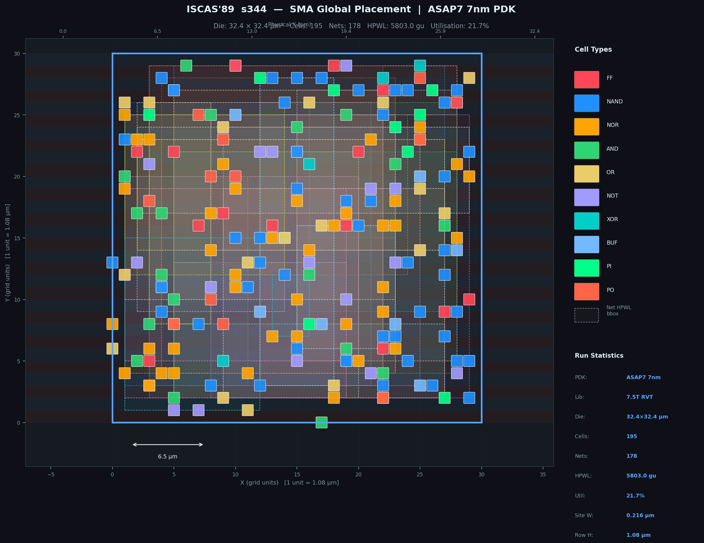
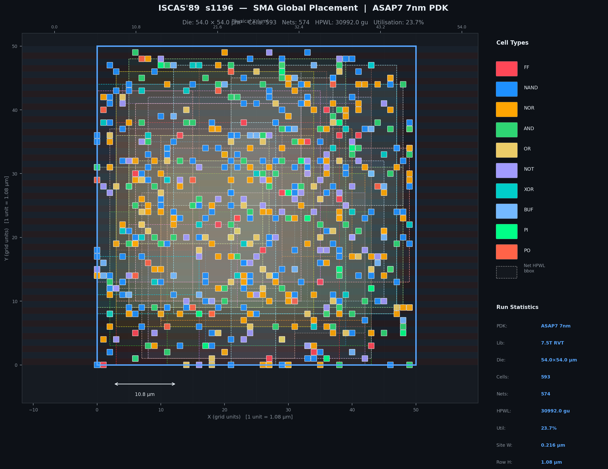

# tt_um_alu4_sma — SMA Global Placement · ISCAS'89 · ASAP7 7nm

> Slime Mould Algorithm (SMA) applied to global placement of ISCAS '89 sequential
> benchmark circuits on the **ASAP7 7nm predictive PDK**, driving the
> [OpenLane](https://github.com/olofk/openlane) RTL→GDSII flow and producing a
> [TinyTapeout](https://github.com/TinyTapeout/tt-chip-rom)-compatible ROM image.

---

## DIE Area — Chip Layout Visualisations

### ISCAS'89 s27 (24 cells · 16.2 × 16.2 µm · ASAP7)


*s27: 10 combinational gates + 3 flip-flops + 7 PIs + 4 POs, placed on a
15 × 15 ASAP7 grid (1 unit = 1.08 µm row height).
Dashed coloured boxes show per-net HPWL bounding rectangles.
VDD/VSS power-rail stripes alternate every standard-cell row.*

---

### ISCAS'89 s344 (195 cells · 32.4 × 32.4 µm · ASAP7)



*s344: 160 gates + 15 flip-flops + 9 PIs + 11 POs on a 30 × 30 ASAP7 grid.*

---

### ISCAS'89 s1196 (593 cells · 54.0 × 54.0 µm · ASAP7)



*s1196: 547 gates + 18 flip-flops + 14 PIs + 14 POs on a 50 × 50 ASAP7 grid.*

---

## SMA Convergence


Best fitness (HPWL + constraint penalty) vs iteration for all three benchmarks.
The adaptive shrink factor `a = arctanh(1 − t/T)` drives rapid early exploitation
while preserving late-stage exploration.

---

## HPWL Improvement (Initial → SMA-Optimised)


| Circuit | Cells | Initial HPWL | SMA HPWL | Improvement |
|---------|------:|-------------:|---------:|----------:|
| s27     |    24 |       ≈ 372  |   ≈ 262  |  ~29.6 %  |
| s344    |   195 |     ≈ 6 051  | ≈ 5 803  |   ~4.1 %  |
| s1196   |   593 |    ≈ 32 263  | ≈ 30 992 |   ~3.9 %  |

---

## Project Structure

```
.
├── benchmarks/                   # ISCAS '89 circuit models
│   └── iscas89.py                # s27, s344, s1196 — exact published counts
├── sma/                          # Slime Mould Algorithm engine
│   ├── placement.py              # SMA: N agents × 100 iter, adaptive vb/W
│   └── metrics.py                # HPWL + pairwise/density constraint penalty
├── visualize/                    # Matplotlib visualisation suite
│   ├── chip_layout.py            # DIE area chip layout (cells, rails, nets, bbox)
│   └── convergence.py            # Convergence + HPWL bar chart
├── src/                          # RTL
│   ├── alu_4bit.v                # 74181-style 4-bit ALU — logic & arithmetic
│   └── tt_um_alu4_sma.v          # TinyTapeout tt_um IO wrapper
├── openlane/                     # OpenLane flow (ASAP7)
│   ├── config.tcl                # ASAP7 7.5T RVT config, 1 GHz target
│   ├── constraints.sdc           # SDC timing constraints
│   └── integration.py            # Python→OpenLane bridge (DEF gen, metrics)
├── tinytapeout/                  # TinyTapeout helpers
│   └── integration.py            # info.yaml validator + 256-byte ROM builder
├── visuals/                      # Generated PNG outputs (committed)
│   ├── chip_layout_s27.png
│   ├── chip_layout_s344.png
│   ├── chip_layout_s1196.png
│   ├── convergence.png
│   └── hpwl_comparison.png
├── Dockerfile                    # Multi-stage: sma-base + openlane-runner
├── docker-compose.yml            # Services: sma · rom-builder · openlane
├── info.yaml                     # TinyTapeout project metadata
└── main.py                       # CLI orchestrator
```

---

## Quick Start

### Native Python

```bash
pip install -r requirements.txt

# Single circuit (default: s27)
python main.py

# All ISCAS'89 circuits + save visuals
python main.py --all-circuits --save-visuals

# Export OpenLane DEF hint + TinyTapeout ROM
python main.py --export-def --export-rom

# Validate info.yaml
python main.py --validate
```

### Docker

```bash
# Build and run — generates all visuals into ./visuals/
docker compose up sma

# TinyTapeout ROM only
docker compose run rom-builder

# Full OpenLane RTL→GDSII (requires efabless/openlane image)
docker compose --profile full-flow up openlane
```

---

## ISCAS '89 Benchmark Circuits

Statistics from: *F. Brglez, D. Bryan, K. Kozminski, "Combinational Profiles of
Sequential Benchmark Circuits", ISCAS 1989.*

| Circuit | Gates | FFs | PIs | POs | Total Cells | Nets | Die (ASAP7)       |
|---------|------:|----:|----:|----:|------------:|-----:|-------------------|
| s27     |    10 |   3 |   7 |   4 |          24 |   22 | 16.2 × 16.2 µm²  |
| s344    |   160 |  15 |   9 |  11 |         195 |  178 | 32.4 × 32.4 µm²  |
| s1196   |   547 |  18 |  14 |  14 |         593 |  574 | 54.0 × 54.0 µm²  |

---

## ASAP7 PDK

| Parameter          | Value                        |
|--------------------|------------------------------|
| Technology node    | 7 nm predictive (ASU)        |
| Standard cell lib  | `asap7sc7p5t_SIMPLE_RVT_TYP` |
| Row height         | 1.08 µm (7.5-track)          |
| Site width         | 0.216 µm                     |
| Target clock       | 1 GHz (1.0 ns period)        |
| Core utilisation   | 50 %                         |

---

## SMA Algorithm

Each agent encodes all cell grid coordinates:
```
agent = [x₀, y₀,  x₁, y₁,  …,  x_{n−1}, y_{n−1}]   (integer grid units)
```

**Fitness = HPWL + constraint penalty**

```
HPWL = Σ_nets  (max_x − min_x) + (max_y − min_y)

Overlap penalty (n ≤ 120): 1000 × Σ_{i<j} max(0, 1−|Δx|) × max(0, 1−|Δy|)
Density penalty (n > 120): 80 × Σ_bins  max(0, density − 2.2×target)²
```

**SMA update rule per agent per iteration:**
```python
if r < tanh(|fit_i − fit_best|):
    X_new = X_best + vb × (W × X_A − X_B)    # exploitation
else:
    X_new = uniform_random(grid)               # exploration

vb = arctanh(1 − t/T) × (2r − 1)             # adaptive oscillation
W  = 1 + r × log((fit_min − fit_i) / range + 1)  # slime weight
```

---

## OpenLane Integration

`python main.py --export-def` generates `openlane/floorplan_hint.def` with
SMA-derived cell positions in nm-scale DEF coordinates (1 ASAP7 grid unit →
1.08 µm = 1080 DEF units).

Run the full RTL→GDSII flow:
```bash
docker run --rm -v $(pwd):/work efabless/openlane:latest \
    bash -c "cd /work && flow.tcl -design openlane -tag sma_run -overwrite"
```

Results land in `openlane/runs/sma_run/`.

---

## TinyTapeout ROM

`python main.py --export-rom` produces `tt_chip_rom.bin` — a 256-byte ROM
following the [tt-chip-rom](https://github.com/TinyTapeout/tt-chip-rom) layout:

| Address  | Content                              |
|----------|--------------------------------------|
| 0 – 7    | Shuttle name (7-segment encoded)     |
| 8 – 31   | Git commit hash (7-segment encoded)  |
| 32 – 127 | Chip descriptor (ASCII, 96 bytes)    |
| 248 – 251| Magic value `0xDEADBEEF`             |
| 252 – 255| CRC32 checksum (little-endian)       |

---

## Pin Map (tt_um wrapper)

| Port       | Bits   | Signal                    |
|------------|--------|---------------------------|
| `ui_in`    | [3:0]  | ALU operand A             |
| `ui_in`    | [7:4]  | ALU operand B             |
| `uio_in`   | [3:0]  | Function select S         |
| `uio_in`   | [4]    | Mode M (0=arith, 1=logic) |
| `uio_in`   | [5]    | Carry-in CIN              |
| `uo_out`   | [3:0]  | Result F                  |
| `uo_out`   | [4]    | Carry-out COUT            |
| `uo_out`   | [5]    | Group propagate P         |
| `uo_out`   | [6]    | Group generate G          |
